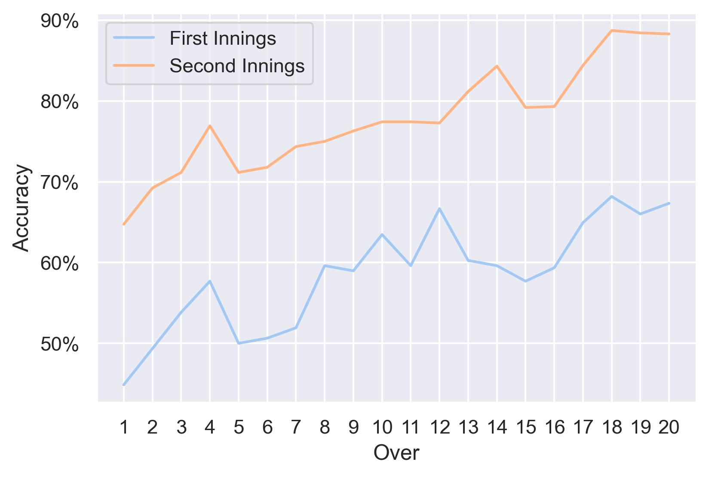

# CA4021 Final Year Project


<!-- #region -->

# Pre-Game and In-Game Outcome Prediction in Cricket

This project predicts the outcome of a T20 cricket match using a selection of features. The project involves analysis of the Indian Premier League (IPL) from 2008-2020 and uses a readily available dataset from Kaggle to build a predictive model. The effects of the toss, venue, city, and team on the outcome within a match are investigated alonside in-game statistics. The dataset can be found [_here_](https://www.kaggle.com/patrickb1912/ipl-complete-dataset-20082020?select=IPL+Matches+2008-2020.csv). A Big Bash league dataset is also used for model validation to measure how robust and transferable the model is on data from different leagues and countries. This dataset can be found [_here_](https://www.kaggle.com/datasets/patrickb1912/big-bash-league-complete-dataset-20112019).

## Table of Contents
* [General Info](#general-information)
* [Technology Used](#technology-used)
* [Project Status](#project-status)
* [Results](#results)
* [Room for Improvement](#room-for-improvement)


## General Information
The objective of this project is to predict the outcome of cricket games' based on a selection of features. The data used in the predictive model is from T20 cricket matches and is from matches within the IPL from the years 2008-2020. This dataset is comprised of a `matches.csv` and `ball_by_ball.csv`. The aim is to gain a greater understanding of what features are most influential in this prediction task. The features used include city, venue, country, toss outcome and teams playing alongside in game scores. The project involves exploring the dataset to identify which aspects of the data carry the strongest weight in prediction and comparing this to domain knowledge within professional cricket as to what is expected. The various periods within the game are explored to see if there are any trends with respect to what sections of the game have the largest impact on the result. 

There are four components to the project:

### Data Analysis
Both csv files within the IPL data are inspected to understand what features may be of use in the predictive analysis. The toss, home advantage, and choosing to bat first or field first are further investigated.

### Data Transformation
The ball by ball dataset is manipulated to created calculated fields for the in-game scores.

### Pre-Game Prediction
Predictive analysis is run on on the `matches` dataset using a variety of pre-game features across a selection of algorithms. 

### In-Game Prediction
In-game statistics are used from the transformed dataset and predictive analysis is run on this data. The BBL data is also used to evaluate the performance of the model and a further evaluation of the model using live in-game betting odds is completed.

## Technology Used
Analysis is completed in python using jupyter notebook. Scikit-learn is used for the predictive models as it has a selection of algorithms appropriate for this task. The selected models are:
- Random Forest
- Support Vector Machine (SVM)
- Logistic regression
- Naïve Bayes
- XGBoost


## Project Status
Project is: completed

## Results

| Model                  |    All data columns  | with Feature Selection | with One hot encoding of teams       | with One hot encoding of home team|
| ---------------------  | ------------- | ------------------- | ------------------- | ------------------------------|
|Random Forest           |   **0.66**    |        0.57         |       **0.65**      |  **0.67**  |
|Logistic Regression     |     0.47      |        0.56         |       0.56          | 0.55|
|Naïve Bayes             |     0.58      |      **0.60**       |       0.57          | 0.55 |
|Support Vector Machine  |     0.56      |        0.55         |       0.56          | 0.55 |
|XGBoost                 |     0.52      |        0.57         |       0.57          | 0.55 |




## Room for Improvement
For future work it would be interesting to add some player features and prior data such as team form to the historic data to see if this improves the pre match prediction. Further drilling down into countries, time of day, and teams would be interesting to see if there could be any improvement on the pre game predictive accuracy.


<!-- #endregion -->

```python

```
